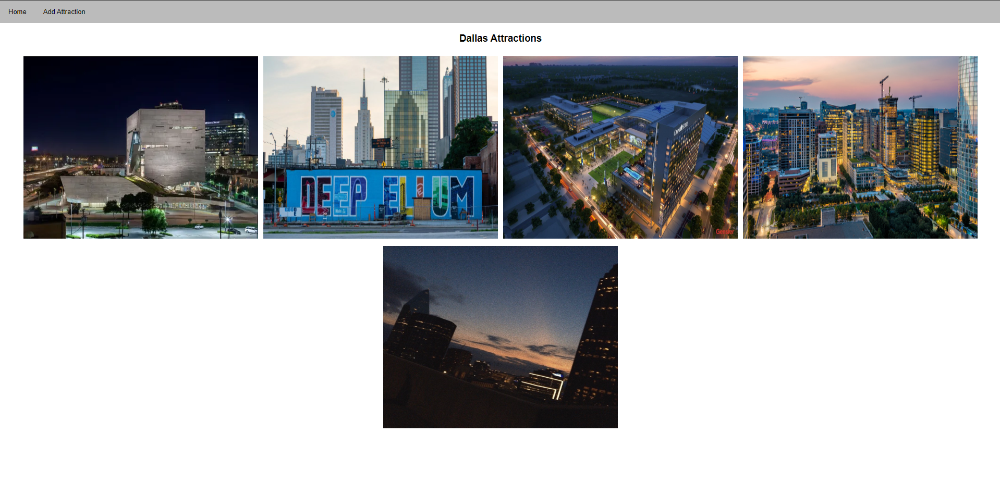
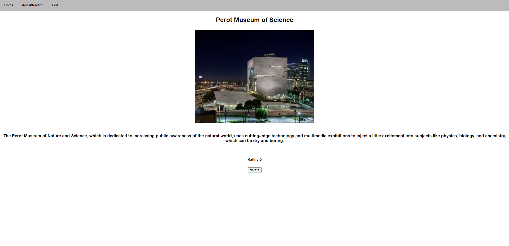
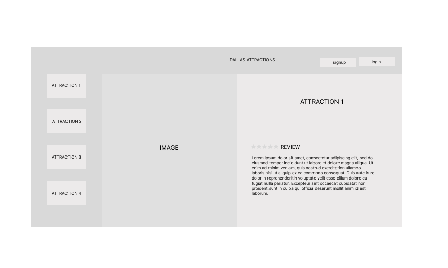

# DallasAttractions

[Trello](https://trello.com/b/QP7ba0Fp/project-2)

## Description
Full CRUD app where users can add Dallas Attractions

## Technologies Used
* HTML5
* CSS3
* EJS
* EXPRESS
* MONGOOSE
* MONGODB
* GOOGLE FONTS

## Screenshots

## Whiteboard Images
* All Sketches are on figma

## Project Next Steps
* More attractive design
* Add accounts

##  VIEW
* You can view the repository:
[Github.com](https://github.com/nicholasmolina2019/DallasAttractions)
[DallasAttractionWebsite](https://dtx-attractionstx.herokuapp.com/dallas)

